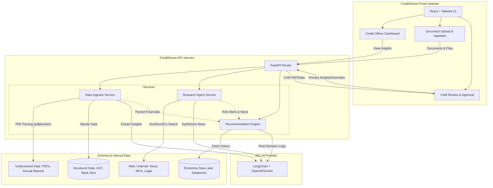

# CreditSense Architecture

CreditSense is an AI-powered Credit Decisioning Engine designed to automate the end-to-end preparation of a Comprehensive Credit Appraisal Memo (CAM). The system is built using a modern, decoupled architecture with a React (Vite) frontend for the Credit Officers and a robust Python (FastAPI) backend to handle the complex AI, data ingestion, and decision logic.

## System Overview

The architecture is divided into three core pillars as required by the Intelli-Credit Challenge:

1. **The Data Ingestor**: Handles parsing of structured (CSV, Excel) and unstructured (PDF) data.
2. **The Research Agent**: An intelligent crawler that performs web-scale secondary research.
3. **The Recommendation Engine**: Synthesizes all data to produce the final CAM and risk decisions.

### High-Level Architecture Diagram

## Core Components Detail

### 1. Frontend (`/website`)

- **Tech Stack**: React 19, TypeScript, Vite, Tailwind CSS v4, Lucide React, React Router.
- **Responsibility**: Provides the user interface for Credit Officers to interact with the system. It visualizes the pipeline (applications pending, approved, high risk), displays intelligence alerts generated by the backend, allows for document upload, and presents the final generated CAM for review and export.

### 2. Backend API (`/servers`)

- **Tech Stack**: Python 3, FastAPI, Uvicorn, Pydantic.
- **Responsibility**: Serves as the central orchestrator. Exposes RESTful endpoints for the frontend to consume. Handles authentication (placeholder), request validation, and routing to the appropriate underlying services.

### 3. Data Ingestor Service (`/servers/services/ingestor.py`)

- **Tech Stack**: PyPDF2, pdfplumber, Pandas, LangChain.
- **Responsibility**:
  - **Unstructured Parsing**: Uses `pdfplumber` to extract text and tables from messy Indian-context PDFs (Annual Reports, Sanction Letters). LangChain is then used to prompt an LLM to extract key financial commitments, covenants, and hidden risks from the raw text.
  - **Structured Synthesis**: Uses Pandas to process tabular data (GST returns, Bank statements) and cross-references them to detect anomalies like circular trading or revenue inflation (The "Data Paradox").

### 4. Research Agent Service (`/servers/services/researcher.py`)

- **Tech Stack**: duckduckgo-search, LangChain, BeautifulSoup (optional).
- **Responsibility**: Acts as the "Digital Credit Manager". Automatically queries the web using search APIs for a given corporate entity, its promoters, and sector keywords. It looks for adverse news, regulatory headwinds (e.g., RBI penalties), and litigation history on platforms like e-Courts, synthesizing this via an LLM into actionable risk alerts.

### 5. Recommendation Engine (`/servers/services/engine.py`)

- **Tech Stack**: LangChain, custom scoring models, PDF/Docx generation libraries.
- **Responsibility**:
  - **CAM Generator**: Combines the output of the Ingestor (financials), Researcher (environmental risks), and Credit Officer manual inputs (primary insights like factory visits) to generate a structured Credit Appraisal Memo (CAM) covering the Five Cs of Credit.
  - **Decision Logic**: Employs an explainable scoring model to suggest loan limits and interest rates. Crucially, it must be able to "walk the judge through" its reasoning using the LLM to provide transparent justifications for approvals or rejections.

## Deployment Strategy (Hackathon Context)

- Both the FastAPI backend and Vite frontend are designed to be run locally during development (`npm run dev` and `uvicorn main:app --reload`).
- For the final submission, they can be containerized using Docker or deployed to platforms like Vercel (Frontend) and Render/Heroku/Railway (Backend).
